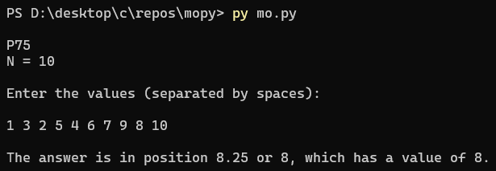

# MOPy

A CLI tool that lets you see the rank of a measure of position using the number of values (N) and percentile (P)

## How To Use

The tool works with percentiles, so it prompts you to input what measure of position you want in percentiles, this is noted as "P". It also asks you how many values there are in the list, noted as "N = ". After taking all inputs, it shows what position/rank is the M.O.P.

